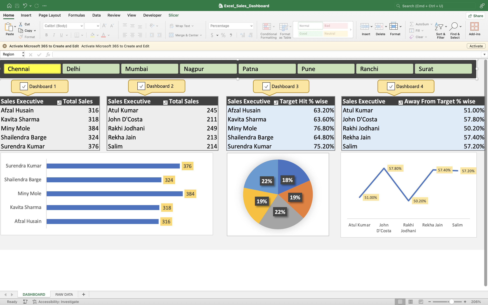
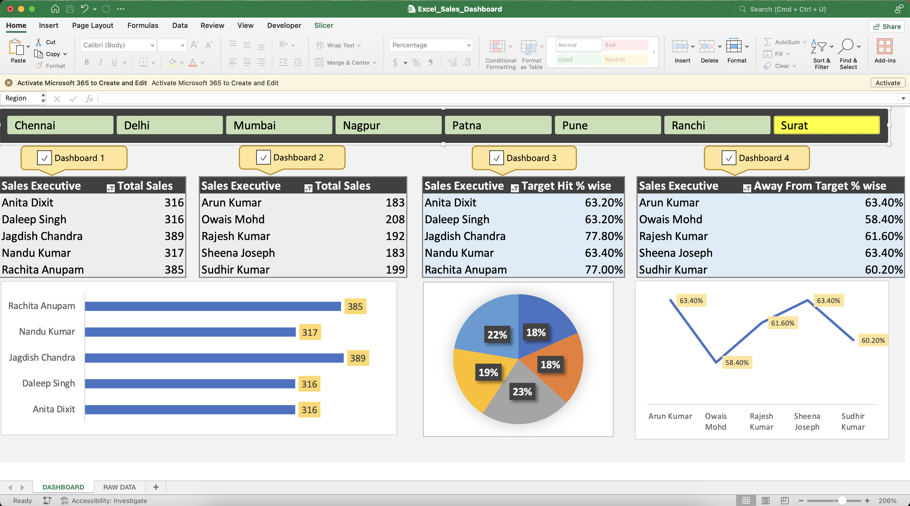

# **Interactive Dashboard in Microsoft Excel**

## **Overview**
This project demonstrates the creation of a fully interactive dashboard in Microsoft Excel, designed to analyze and visualize data effectively. It showcases advanced Excel techniques such as Pivot Tables, slicers, and form controls to make data insights accessible and actionable.

## **Key Features**
- **Dynamic Data Visualization**:
  - Displays top-performing and underperforming sales executives.
  - Provides insights into sales performance by region, product category, and time period.
- **Advanced Excel Features**:
  - Includes slicers for interactivity.
  - Utilizes Pivot Tables for data analysis.
  - Features form controls (e.g., checkboxes) for dynamic dashboard updates.
- **Customization**:
  - Conditional formatting applied for better data representation.
  - User-friendly and visually engaging layout.
- **Automation**:
  - Incorporates macros to link slicers with specific data tables, simplifying navigation and filtering.

## **Tools and Technologies Used**
- **Microsoft Excel**:
  - Pivot Tables
  - Form Controls
  - Slicers
  - VBA Macros
- **Data Analysis Techniques**:
  - Performance tracking and KPI visualization.

## **How to Use**
1. Download the Excel file from this repository.
2. Open it in Microsoft Excel (2016 or later recommended).
3. Follow the interactive dashboard to explore insights using:
   - Slicers for filtering data by sales executive, region, or other fields.
   - Checkboxes to switch between different views or subsets of data.
4. Run VBA macros (if enabled) for enhanced automation.

## **Screenshots**

***Interactive Dashboard in Microsoft Excel***

  
 

## **Future Enhancements**
- Expand the dataset to include additional dimensions like customer demographics or product details.
- Integrate real-time data updates via external databases or APIs.
- Enhance visuals using tools like Power BI or Tableau.
